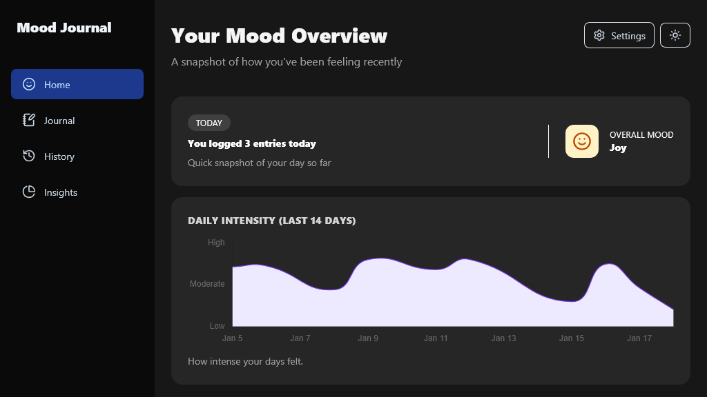

# Mood Journal

Offline-first Progressive Web App (PWA) for multi-label emotion classification and journaling. Emotion classification is powered by a fine-tuned SetFit model using MiniLM embeddings, with inference running entirely client-side via ONNX Runtime Web and Transformers.js

FastAPI serves the web application and model assets; all inference is executed locally in the browser.



## Key Features
- Offline-first PWA
	- All inference and journaling run fully client-side via a service worker and Transformers.js
	- Emotion analysis is performed locally in the browser so no user data or journal entries ever leave the device
- Service worker powered by Workbox
	- Pre-caches the ONNX model and tokenizer assets required for offline inference
	- After first load, all features (including ML) work fully offline (offline-first caching strategy)
- Multi-label emotion classification
	- Fine-tuned SetFit (MiniLM) classifier predicts multiple emotions from a single journal entry
	- SetFit was selected because it provides strong performance on limited labeled datasets

## Tech Stack

**Backend/ML:** Python, FastAPI, PyTorch, Transformers, ONNX Runtime

**Frontend:** React, TypeScript, Vite, Tailwind CSS, Workbox

## Demo

- Live demo: [https://mood-tracker.projects.jaisawhney.me/](https://mood-tracker.projects.jaisawhney.me/)

## Project Structure

```text
├── apps/
│   ├── api/            # FastAPI backend
│   └── web/            # React/Vite frontend
├── docker/             # Container configuration
├── images/             # README assets
├── ml/
│   ├── config.py       # Typed config loader
│   ├── config.yaml     # Project configuration
│   ├── data.py         # Dataset loading
│   ├── datasets/       # Train/validation/test datasets
│   ├── export.py       # ONNX export pipeline
│   ├── inference.py    # Document-level inference
│   ├── evaluate.py     # Model benchmarking
│   ├── trainer.py      # SetFit training
│   └── validate.py     # Model evaluation
├── notebooks/          # Experimentation
├── tests/              # Test suite
├── pyproject.toml
└── README.md
```

## Model Performance

| Metric | Score |
|--------|------:|
| Macro F1 | 0.417 |
| Micro F1 | 0.548 |
| Macro ROC AUC | 0.804 |
| Hamming Loss | 0.176 |

The dataset is highly imbalanced across emotion labels. Despite class rebalancing and hyperparameter optimization, minority classes remain the main source of prediction error.

## Datasets
- Lemotif (Li & Parikh, arXiv 2019): Journaling dataset derived from personal journal entries, used for fine-tuning and evaluation

## Data Preprocessing:
- Undersampling of majority classes to reduce class imbalance

## Notebooks
- `01_dataset_exploration.ipynb`: Exploratory Data Analysis
- `02_data_preprocessing.ipynb`: Data Preprocessing & Class Rebalancing
- `03_hyperparameter_optimization.ipynb`: Hyperparameter Optimization (Optuna)
- `04_final_model_evaluation.ipynb`: Final Model Evaluation

## Installation & Usage

### Prerequisites
- Python 3.10+
- Node.js 18+ (for frontend dev)

### Install Python dependencies
```bash
pip install -e ".[api,ml,dev]"
```

### Train the model
```bash
python -m ml.trainer
```

### FastAPI (development)
```bash
uvicorn apps.api.main:app --reload
```
API docs: http://localhost:8000/docs

### Frontend (development)
```bash
cd apps/web
npm install
npm run dev
```

## Docker

Start locally with docker-compose (models mounted from `MODELS_DIR`):

```bash
export MODELS_DIR=/path/to/models
docker compose up --build -d
```

Model files from `MODELS_DIR` are served inside the container at `/api/models`.

## Testing
```bash
pytest
```

## References

- Dataset: `lemotif` (Li & Parikh, arXiv 2019)